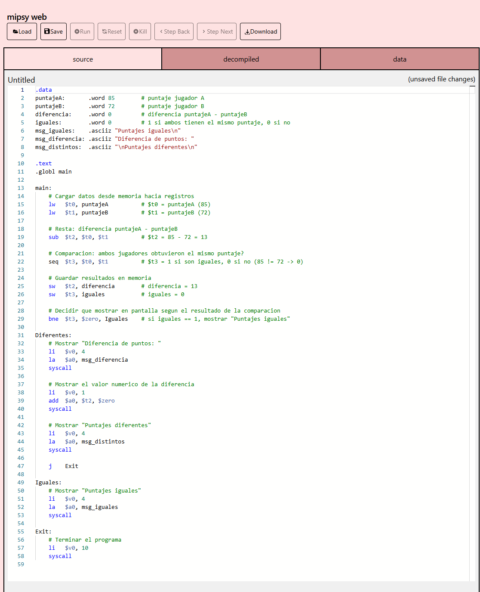
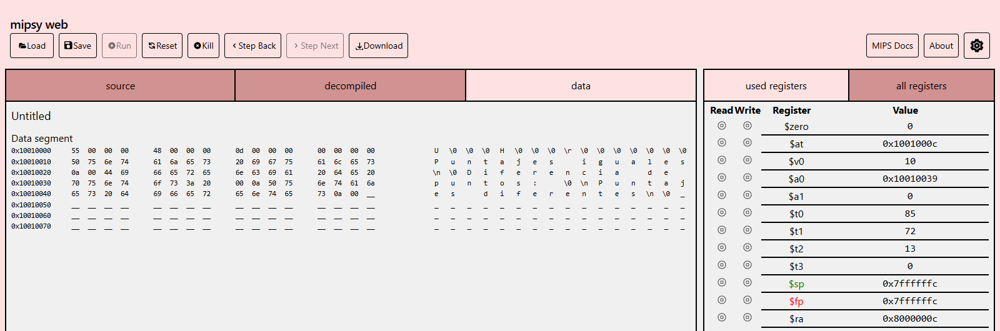
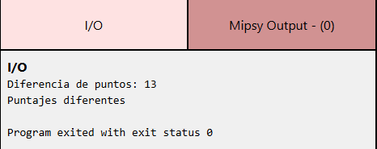

# Comparación de puntajes en MIPS

**Asignatura:** UCOM250 – Organización y Arquitectura de Computadores  
**Integrantes:** Allan Becerra y Jeremy Llerena (Grupo 7)  
**Año:** 2026  
**Fecha:** 8 de octubre de 2026

---

## Descripción

### Escenario

Dos jugadores, A y B, terminan una partida y sus puntajes quedan almacenados en memoria: el jugador A obtuvo **85** puntos y el jugador B **72**. El programa debe determinar por cuántos puntos supera el jugador A al jugador B y si ambos obtuvieron el mismo puntaje.

### Resultado

El programa carga los dos puntajes desde memoria, calcula la diferencia `puntajeA - puntajeB` (13), compara si los puntajes son iguales y guarda ambos resultados en memoria. Según la comparación decide qué mostrar: si los puntajes son iguales imprime `Puntajes iguales`; si son distintos imprime la diferencia. Con los datos del escenario se muestra:

```text
Diferencia de puntos: 13
Puntajes diferentes
```

---

## Análisis

### Datos del programa

| Dato | Valor inicial | Propósito |
|---|---:|---|
| `puntajeA` | 85 | Puntaje del jugador A |
| `puntajeB` | 72 | Puntaje del jugador B |
| `diferencia` | 0 → **13** | Diferencia `puntajeA - puntajeB` |
| `iguales` | 0 → **0** | 1 si ambos tienen el mismo puntaje, 0 si no |

### Operaciones requeridas

| Datos / Resultados | Propósito | Operación requerida | Instrucción MIPS |
|---|---|---|---|
| `puntajeA` → `$t0` | Cargar el puntaje A desde memoria | Carga | `lw` |
| `puntajeB` → `$t1` | Cargar el puntaje B desde memoria | Carga | `lw` |
| `$t2` | Diferencia de puntajes (85 − 72 = 13) | Resta | `sub` |
| `$t3` | ¿Mismo puntaje? (85 ≠ 72 → 0) | Comparación | `seq` |
| `diferencia`, `iguales` | Guardar los resultados en memoria | Almacenamiento | `sw` |
| Mensaje en pantalla | Ir a `Iguales` solo si `$t3` es 1 | Salto condicional | `bne` |
| Pantalla | Mostrar los resultados | Salida | `syscall` |

Instrucciones utilizadas en el programa:

- `lw`: cargar un dato desde memoria.
- `sw`: almacenar un resultado en memoria.
- `sub`: realizar una resta.
- `seq`: determinar si dos valores son iguales.
- `bne`: realizar un salto si dos valores son diferentes.
- `syscall`: mostrar información por pantalla.

---

## Implementación

### Versión base

La carpeta `version_base/` contiene el programa proporcionado como punto de partida de la actividad.

**Archivo:**

```text
version_base/programa_base.s
```

**Estado inicial del programa:**

Es el archivo `01 - base.s` entregado en clase. Declara en `.data` dos datos (`dato1 = 40`, `dato2 = 12`) y dos resultados en 0. En `.text` solo tiene la estructura de `main` con comentarios que indican dónde cargar los datos (`lw`), hacer las operaciones y guardar los resultados (`sw`); todavía no tiene instrucciones que procesen los datos.

### Versión final

La carpeta `version_final/` contiene el programa desarrollado por el grupo.

**Archivo:**

```text
version_final/programa_final.s
```

La versión final se construyó en tres avances a partir de la versión base:

1. **Avance 1:** se cambiaron los datos por los del escenario (85 y 72) y se agregaron `lw`, `sub`, `seq` y `sw`.
2. **Avance 2:** se renombraron los datos (`puntajeA`, `puntajeB`, `diferencia`, `iguales`), se agregó el salto `bne` y la salida por pantalla.
3. **Versión final:** se agregó el mensaje `Puntajes diferentes`, los saltos de línea y el cierre del programa con `syscall 10`.

Incluye:

- Carga de los datos almacenados en memoria.
- Procesamiento mediante registros.
- Operaciones aritméticas o de comparación requeridas.
- Uso de `bne` para controlar el flujo.
- Almacenamiento de los resultados en memoria.
- Presentación del resultado por pantalla.
- Comentarios explicativos dentro del código.

---

## Evidencias de ejecución

### Código



**Descripción:**  
Código de la versión final en mipsy web. En `.data` están los puntajes (85 y 72), los resultados y los mensajes. En `.text` se distinguen los bloques comentados: carga (`lw`), resta (`sub`), comparación (`seq`), almacenamiento (`sw`), la decisión con `bne` y los bloques `Diferentes`, `Iguales` y `Exit`.

### Registros



**Descripción:**  
`$t0 = 85` y `$t1 = 72` son los puntajes cargados desde memoria; `$t2 = 13` es la diferencia `puntajeA - puntajeB`; `$t3 = 0` indica que los puntajes no son iguales; `$v0 = 10` es el código del último `syscall`, el que termina el programa. En el segmento de datos, a partir de `0x10010000`, se ven en hexadecimal: `55` (85), `48` (72), `0D` (13) y `00` (0).

### Resultado



**Descripción:**  
Como `$t3 = 0`, la instrucción `bne` no salta a `Iguales` y el programa continúa en el bloque `Diferentes`: imprime `Diferencia de puntos: 13` y `Puntajes diferentes`. Luego salta a `Exit` y termina con estado 0.

---

## Conclusiones

Al principio nos costó entender que en MIPS los datos no se usan directamente desde la memoria. Primero hay que pasarlos a un registro con `lw` y al final devolverlos con `sw`. Cuando vimos los valores cambiar en el panel de registros y después en el segmento de datos, entendimos mucho mejor cómo viaja la información que cuando lo vimos solo en clase.

Lo que más trabajo nos dio fue la versión final, sobre todo mostrar los resultados en pantalla y usar `bne` para elegir el mensaje. Tuvimos que revisar la documentación del simulador para saber qué número de `syscall` usar en cada caso y ejecutar el programa paso a paso varias veces hasta que el salto funcionó como esperábamos.

También nos confundió que el segmento de datos mostrara los valores en hexadecimal. Pasarlos a decimal (55 es 85, 48 es 72 y 0D es 13) nos ayudó a comprobar que el programa guardaba bien los resultados.

Si tuviéramos que hacer la actividad otra vez, primero anotaríamos en papel qué registro guarda cada dato y probaríamos desde el inicio con dos puntajes iguales, para revisar los dos caminos del programa.

---

## Documentación

El reporte completo del proyecto se encuentra en:

```text
documentacion/reporte_proyecto.pdf
```

[Ver reporte del proyecto](documentacion/reporte_proyecto.pdf)

---

## Estructura del repositorio

```text
miniproyecto01/
│
├── README.md
│
├── version_base/
│   └── programa_base.s
│
├── version_final/
│   └── programa_final.s
│
├── evidencias/
│   ├── codigo.png
│   ├── registros.png
│   └── resultado.png
│
└── documentacion/
    └── reporte_proyecto.pdf
```

---

## Bibliografía

1. University of New South Wales. (s. f.). *MIPS instruction set*. https://cgi.cse.unsw.edu.au/~cs1521/current/resources/mips-guide.html

2. University of New South Wales. (s. f.). *mipsy web* [Simulador MIPS]. https://cgi.cse.unsw.edu.au/~cs1521/mipsy/

3. Patterson, D. A., & Hennessy, J. L. (2021). *Computer organization and design: The hardware/software interface* (6.ª ed.). Morgan Kaufmann.
